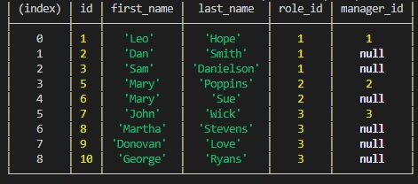
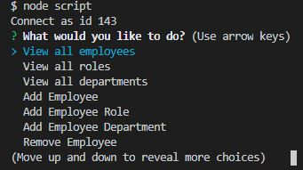
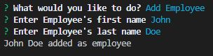
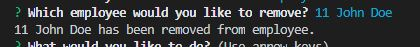
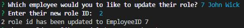
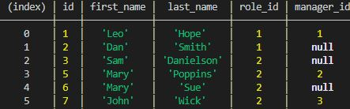

# Employee Tracker



## Description 

This project involves creating an CLI to allow users to view and manage company information that is stored in the database. Features include view all employee, role, and department information, adding and removing information, and updating employee roles. 

## Resources Used

* MySQL WorkBench 
* Dependences
  * Inquirer 
  * mysql

## Table of Contents

* [Installation](#installtion)
* [Usage](#usage)
* [Tests](#tests)
* [Author](#author)


## Installation
Before installing, ```Node.js``` must be installed to run.
Once cloned from the repository, navigate to the project file and run the following command:
```javascript
npm i 
```
This will install the dependencies ```inquirer``` and ```mysql``` that are necessary for this application to function.
Once dependencies are installed, run ```node script``` to begin the application.

## Usage



At the main menu, you can navigate using the up and down arrow keys and hitting Enter to select an item. 
For instance, you can select ```Add Employee``` and type in the first and last name respectively and that name will be added in the database.




New employee added.

You may also update or remove exisiting information in the database.



Removed John Doe from employee table.





Updated employee **John Wick** role ID.

## Tests
To ensure this project runs the minimum functions, a seed sql file has been made to pre-populate the database to ensure the basic functionalities are met. 

## Author

[lu-gflores](https://github.com/lu-gflores)
